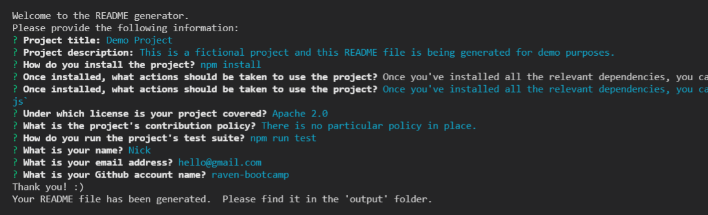
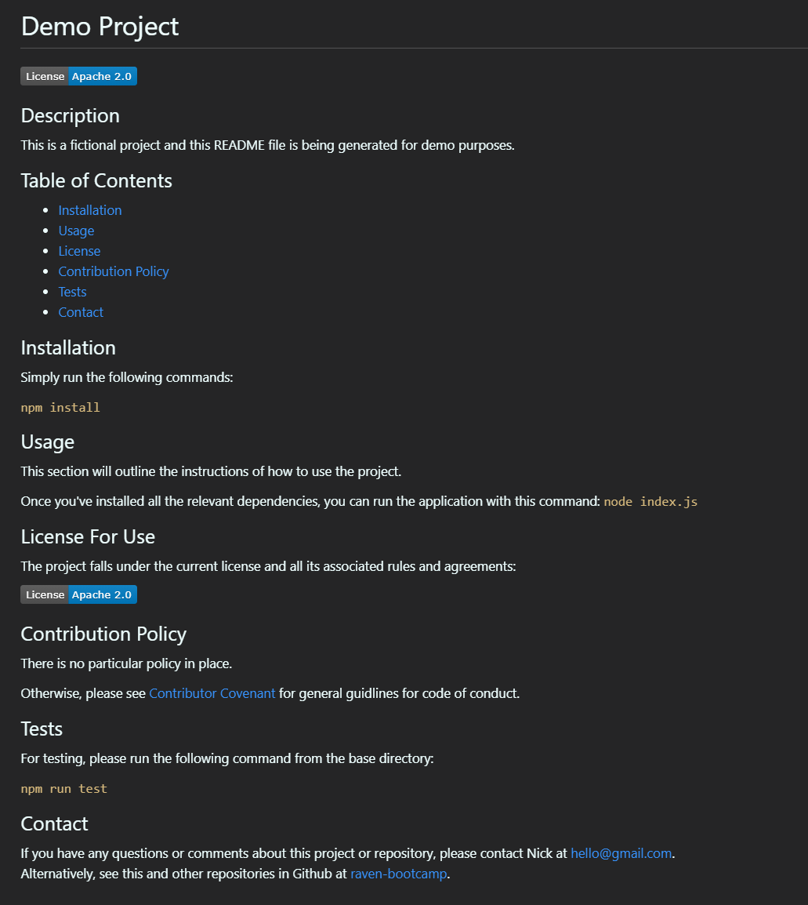

# README Generator
Link to instructional video: https://youtu.be/UnheASVHGVU

Link to code repository: https://github.com/raven-bootcamp/README-generator

## Table of Contents
- [The Task](#the-task)
- [Instructions for Use](#instructions-for-use)
- [Technologies Used](#technologies-used)
- [User Story](#user-story)
- [Acceptance Criteria](#acceptance-criteria)
- [Screenshot of UI](#screenshot-of-ui)
- [Screenshot of Generated File](#screenshot-of-generated-file)
## The Task
Our task is to create a command-line application that dynamically generates a professional README.md file from a user's input using the Inquirer package. 

The application will be invoked by using the following command:

`node index.js`

Because this application won’t be deployed, we also need to provide a link to a walkthrough video that demonstrates its functionality. 
## My Approach
Originally, I had all the logic in a single JS file (i.e. `index.js`).  This included information about licensing and the associated badges, as well as the template code for creating the README file.

Eventually I split the logic into three other separate JS files and put them in a folder called `scripts`.  This folder includes the following:
1. `gatherContents.js` - this is a list of questions and other methods of gathering information using Inquirer.
1. `generateMarkdown.js` - this file contains the template for the Markdown file to be generated.
1. `licenseDetails.js` - this file contains the details and links for the supported licensing agreements and badges.

## Instructions For Use
These instructions assume you have Git working on your computer.
1. Copy the URL of the code repository to the clipboard (listed at the top of this README file)
1. Clone the repository to your local machine by moving to a directory in your command line, and type `git clone [repo url]` without the square brackets
1. Move into the newly checked-out directory of the code: `cd [directory]`
1. Install the dependencies required for the application: `npm install`
1. Once the installation is finished, check to see that you have the following directories:
    - node_modules
    - output
1. Run the application by typing this command: `node index.js`
1. Answer all the questions asked by the application
1. Change to the `output` directory to find your newly generated README file

## Technologies Used
- [Node.js](https://nodejs.org/en/)
- NPM libraries:
    + [FS (File System)](https://nodejs.org/api/fs.html#fs_fs_writefile_file_data_options_callback)
    + [Inquirer](https://www.npmjs.com/package/inquirer)
    + [Util](https://www.npmjs.com/package/util)

## User Story
```
AS A developer
I WANT a README generator
SO THAT I can quickly create a professional README for a new project
```

## Acceptance Criteria
```
GIVEN a command-line application that accepts user input
WHEN I am prompted for information about my application repository
THEN a high-quality, professional README.md is generated with the title of my project and sections entitled Description, Table of Contents, Installation, Usage, License, Contributing, Tests, and Questions
WHEN I enter my project title
THEN this is displayed as the title of the README
WHEN I enter a description, installation instructions, usage information, contribution guidelines, and test instructions
THEN this information is added to the sections of the README entitled Description, Installation, Usage, Contributing, and Tests
WHEN I choose a license for my application from a list of options
THEN a badge for that license is added near the top of the README and a notice is added to the section of the README entitled License that explains which license the application is covered under
WHEN I enter my GitHub username
THEN this is added to the section of the README entitled Questions, with a link to my GitHub profile
WHEN I enter my email address
THEN this is added to the section of the README entitled Questions, with instructions on how to reach me with additional questions
WHEN I click on the links in the Table of Contents
THEN I am taken to the corresponding section of the README
```

## Screenshot of UI


## Screenshot of Generated File
